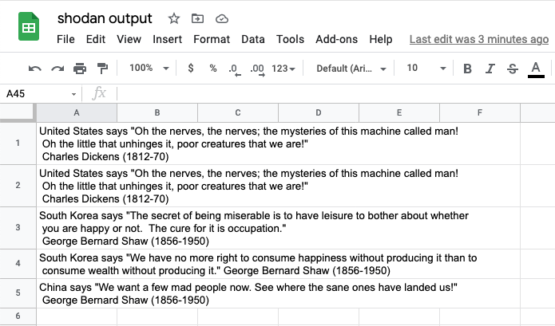

# Useful python
Now that we have a framework to create a serverless function that runs whenever we want, lets add some common elements that make this pattern useful.

Most functions end up being a combination of:

- retrieving a configuration (environment variables)
- retrieving a secret (usually an api key or username/password)
- using the secret to call a web api
- doing something with the data

The following sections will walk through some sample code to use this pattern to:
- get a configuration for an apikey name
- retrieve the apikey from aws secret manager
- use the secret to call a web api
- log the result

## Configuration
Good code avoids hardcoding things like URLs, filenames, etc. Usually this is done through a configuration file or command line options. In a serverless environment we want to avoid physical things like files or user input as much as possible, so we will use environment variables to set and get our configuration.

### Python
The python code to get a value from an environment variable is simple:

```python
import os

config_value = os.environ.get('variable_name','default_value')
```

For our python code we'll get the name of the api key we are going to use. Ensure your handler.py looks like this:

```python
import os
import logging

logger = logging.getLogger()
logger.setLevel(logging.DEBUG)

API_KEY_NAME = os.environ.get("API_KEY_NAME", "api_key")

def cron(event, context):
    logger.debug("Event is: {}".format(event))
    logger.debug("Context is: {}".format(context))
    logger.debug("API Key name is: {}".format(API_KEY_NAME))

```

This will prompt the function to retrieve the api key name on startup and log it to debug output when we run.


### Serverless
In the serverless framework we can set the value for an environment variable by specifying it in the serverless.yml config file

```yaml
environment:
  VARIABLE_NAME: 'value'
```

For our project ensure the 'provider' section of your serverless.yml file looks like this:

```yaml
provider:
  name: aws
  runtime: python3.7
  stage: ${opt:stage,'dev'}
  region: us-west-2
  environment:
    ENVIRONMENT: ${self:provider.stage}
    REGION: ${opt:region, self:provider.region}
    API_KEY_NAME: 'kickstart_api_key'
```

If you like you can deploy this version and test the output using the same pattern as earlier to deploy and print the logs. If it is working correctly you should see 'kickstart_api_key' logged as the value of the api key name:


```
2021-02-14 11:49:26.318 (-08:00)	3be5e694-97c6-43cd-ae8d-1bc8fa1c956c	[DEBUG]	API Key name is: kickstart_api_key
```


## Secrets
Good code doesn't store secrets insecurely. AWS has a service just for this called secrets manager! Here's how we use it in our serverless function.

### AWS
To store a secret in [AWS secrets manager](https://docs.aws.amazon.com/cli/latest/reference/secretsmanager/create-secret.html#examples) from the command line, issue this statement:

```bash
aws secretsmanager create-secret --name kickstart_api_key --description "kickstart tutorial api key" --secret-string "apikeygoeshere"
```

You should receive output like this:
```bash
{
    "ARN": "arn:aws:secretsmanager:us-west-2:0123456789012:secret:kickstart_api_key-3aiKqB",
    "Name": "kickstart_api_key",
    "VersionId": "e0dab410-fe1c-4124-b58c-dbbf49c8eb90"
}
```
You can see that AWS has generated an [Amazon Resource Name (ARN)](https://docs.aws.amazon.com/general/latest/gr/aws-arns-and-namespaces.html) for our secret, along with the friendly name we gave for it and a version.

To retrieve your secret from the command line:

```bash
aws secretsmanager get-secret-value  --secret-id  kickstart_api_key
```

You should receive output like this:

```bash
{
    "ARN": "arn:aws:secretsmanager:us-west-2:0123456789012:secret:kickstart_api_key-3aiKqB",
    "Name": "kickstart_api_key",
    "VersionId": "e0dab410-fe1c-4124-b58c-dbbf49c8eb90",
    "SecretString": "apikeygoeshere",
    "VersionStages": [
        "AWSCURRENT"
    ],
    "CreatedDate": "2021-02-14T12:28:22.422000-08:00"
}
```

To update/change an existing secret issue the following statement from the command line:
```bash
aws secretsmanager update-secret --secret-id kickstart_api_key --secret-string "newapikeygoeshere"
```

### Python
Now that we have a sample secret stored, lets hook it up to our python function.

First we will need to add the [boto](https://pypi.org/project/boto3/) library so we can hook into AWS services. From the command line add boto3 using pipenv:

```bash
pipenv install boto3
```

Now alter your handler.py function to include the following statements:

```python
import boto3  # put this in your include section at the top


# put these just after your API_KEY_NAME config retrieval
boto_session = boto3.session.Session()
secrets_manager = boto_session.client("secretsmanager")
API_KEY = secrets_manager.get_secret_value(SecretId=API_KEY_NAME)["SecretString"]


#temporarily add this to your debug statements in your cron function (properly indented)
logger.debug("API Key is: {}".format(API_KEY))

```

Lastly we will need to update our serverless deployment to let AWS know the function will need access to the secret we have created.

In your serverless.yml file add the following to the provider stanza:


```yaml

  iamRoleStatements:
    - Effect: Allow
      Action:
        - secretsmanager:GetSecretValue
      Resource:
        - "arn:aws:secretsmanager:${opt:region, self:provider.region}:*:secret:${self:provider.environment.API_KEY_NAME}*"

```
This allows our function to get the secret value for the ARN associated with our secret. You'll notice we are pulling portions of the ARN from variables within the serverless.yml file, and ending with they API_KEY_NAME* to allow for the unique random bit aws appends to the end ( kickstart_api_key-3aiKqB in this case ).


At this point you can deploy your function and it should be able to read and log the dummy value we used as an api key secret.

NOTE: Be sure that your Pipfile is in the same directory as your serverless.yml file so that the serverless framework is able to notice that we will be using the boto3 and can package it up when it sends the function to AWS.

When you are satisfied it works, be sure to remove the:

```python
logger.debug("API Key is: {}".format(API_KEY))

```

statement as we should never log secrets.

## Useful python: Shodan
[Shodan](https://shodan.io) is a great resource for any security professional. It constantly scans the internet, collecting and cataloging intelligence on open ports and services.

Let's hook our serverless function up to it to gather some interesting data. If you don't have an account, take a moment to sign up (free as of this writing) and make note of the api key for your account.

There [are a bunch of useful queries](https://github.com/jakejarvis/awesome-shodan-queries) you can run with shodan. Lets target the windows version of [the quote of the day service by looking for port 17 on a windows system](https://github.com/jakejarvis/awesome-shodan-queries#tcp-quote-of-the-day--).


### python
First, lets add the [requests library](https://pypi.org/project/requests/) to do the api call/retrieval.

```bash
pipenv install requests
```
Next up, alter your handler.py code to import requests and build the url we will use for an HTTPS GET request.

```python
import requests # add to your import section at the beginning

# add just before the cron function
QUERY='port:17 product:"Windows qotd"'
url=f"https://api.shodan.io/shodan/host/search?key={API_KEY}&query={QUERY}"

```

And alter your cron function to be the following:

```python
def cron(event, context):
    logger.debug("Event is: {}".format(event))
    logger.debug("Context is: {}".format(context))
    logger.debug("API Key name is: {}".format(API_KEY_NAME))

    shodan_results = []
    result_count = 0
    result = requests.get(url)
    if result.status_code == 200:
        shodan_results = result.json()["matches"]
        result_count = result.json()["total"]
        for result in shodan_results[:5]:
            logger.info(f"{result['location']['country_name']} says {result['data']}")

    logger.info(f"retrieved {len(shodan_results)} out of {result_count} total results ")

```

As you can see, now in our handler cron function we are calling shodan, checking the status code and returning portions of the top 5 quotes and some basic stats about the results.

### Deployment
Be sure to set your api key in AWS to the one you retrieved from your shodan account:

```bash
aws secretsmanager update-secret --secret-id kickstart_api_key --secret-string "shodan api key goes here"
```


Deploy your latest version:
(NOTE: Be sure that your Pipfile is in the same directory as your serverless.yml file so that the serverless framework is able to notice the dependencies (boto3, requests) and can package it up when it sends the function to AWS.)

```bash
sls deploy --stage dev
```

And after a minute (or whatever your frequency is set to), you should see the results in the logs or you can invoke the function to have it run immediately:

```bash
sls invoke --function serverless-cron
```

```bash
sls logs --function serverless-cron
```

You should see output similar to :

```bash

START RequestId: 8233c30e-9ff1-4731-b4e9-7f94ef0d70d1 Version: $LATEST
2021-02-14 17:29:41.342 (-08:00)	8233c30e-9ff1-4731-b4e9-7f94ef0d70d1	[DEBUG]	Event is: {}
2021-02-14 17:29:41.342 (-08:00)	8233c30e-9ff1-4731-b4e9-7f94ef0d70d1	[DEBUG]	Context is: <bootstrap.LambdaContext object at 0x7f31b75b8d50>
2021-02-14 17:29:41.342 (-08:00)	8233c30e-9ff1-4731-b4e9-7f94ef0d70d1	[DEBUG]	API Key name is: kickstart_api_key
2021-02-14 17:29:41.344 (-08:00)	8233c30e-9ff1-4731-b4e9-7f94ef0d70d1	[DEBUG]	Starting new HTTPS connection (1): api.shodan.io:443
2021-02-14 17:29:41.649 (-08:00)	8233c30e-9ff1-4731-b4e9-7f94ef0d70d1	[DEBUG]	https://api.shodan.io:443 "GET /shodan/host/search?key=<somekey>&query=port:17%20product:%22Windows%20qotd%22 HTTP/1.1" 200 None
2021-02-14 17:29:41.710 (-08:00)	8233c30e-9ff1-4731-b4e9-7f94ef0d70d1	[INFO]	Bangladesh says "My spelling is Wobbly.  It's good spelling but it Wobbles, and the letters
get in the wrong places." A. A. Milne (1882-1958)
2021-02-14 17:29:41.711 (-08:00)	8233c30e-9ff1-4731-b4e9-7f94ef0d70d1	[INFO]	Brazil says "A vida, como a antiga Tebas, tem cem portas. Feche uma, outras se abrirao."\r\n ("Viver, v\xa0rias hist\xa2rias", Machado de Assis)\r\n
2021-02-14 17:29:41.711 (-08:00)	8233c30e-9ff1-4731-b4e9-7f94ef0d70d1	[INFO]	United States says "Here's the rule for bargains: "Do other men, for they would do you."
That's the true business precept." Charles Dickens (1812-70)
2021-02-14 17:29:41.711 (-08:00)	8233c30e-9ff1-4731-b4e9-7f94ef0d70d1	[INFO]	South Korea says "Man can climb to the highest summits, but he cannot dwell there long."
George Bernard Shaw (1856-1950)
2021-02-14 17:29:41.711 (-08:00)	8233c30e-9ff1-4731-b4e9-7f94ef0d70d1	[INFO]	South Korea says "A wonderful fact to reflect upon, that every human creature is constituted
to be that profound secret and mystery to every other."
Charles Dickens (1812-70)
2021-02-14 17:29:41.711 (-08:00)	8233c30e-9ff1-4731-b4e9-7f94ef0d70d1	[INFO]	retrieved 100 out of 37401 total results
```

Please note that leaving this function set to run at a high frequency isn't encouraged as it will likely use all of your shodan.io api request call allotment.


## Useful python: Google Sheets
So now we can call an api, retrieve information and do basic logging of that information. Lets make this a bit more useful and send the output of the api to somewhere. Google sheets is a good destination as it involves yet another api and can allow us to have our output visible beyond just the serverless logs.

In this section we will take the output from shodan and put it in a Google sheet [using the gspread library](https://pypi.org/project/gspread/).


### Google Authentication
Google's apis can be accessed by making a project and creating a service account that is granted access to the specific apis needed. Gspread does a [good job explaining the process here in the section "for Bots: using a service account](https://gspread.readthedocs.io/en/latest/oauth2.html#enable-api-access-for-a-project).


The steps are roughtly:

- Create a new project in the [google developers console](https://console.developers.google.com/project)
- Add the google drive api to the project (search apis and enable)
- Add the google sheets api to the project (search apis and enable)
- Create a [service account](https://console.cloud.google.com/iam-admin/serviceaccounts), create a service account key and download the .json file with credentials.

This json file will have the private key, client id and client email address for the service account. Keep this file safe and don't upload it to any public sites (github, etc).

Create a spreadsheet called 'shodan output' in google sheets and 'share' editor access to the sheet to the client email address listed in the json file. It should be something like 'service-account-name@project-name@iam.gserviceaccount.com'.

Now that we have the google part configured, lets modify our serverless function to send it's output to our google sheet.

### Serverless
To allow serverless access to our google sheet we need to:
- enable the gspread library
- store the service account json credential in secrets manager
- allow the serverless function access to the AWS secret holding the json credential
- modify our code to authenticate with this credential and store output in the google sheet

To enable the gspread library issue the following statement at the command line:

```bash
pipenv install gspread
```

To store the service account json credential in secrets manager issue the following statement at the command line:

```bash
aws secretsmanager create-secret --name kickstart_service_account --description "kickstart tutorial google service acount" --secret-string file://path/to/your/jsonfile.json
```

Allow your function to access the credentials by adding a permission in your serverless.yml file. You'll need a new environment variable holding the name you gave to the service account secret, and a role statement granting permission to read the secret:

```yaml
  ENVIRONMENT:
    SERVICE_ACCOUNT_SECRET_NAME: 'kickstart_service_account'
  iamRoleStatements:
    - Effect: Allow
      Action:
        - secretsmanager:GetSecretValue
      Resource:
        - "arn:aws:secretsmanager:${opt:region, self:provider.region}:*:secret:${self:provider.environment.SERVICE_ACCOUNT_SECRET_NAME}*"
```

### Python
Now that we have a secret granting us permission, lets wire up gspread to use the secret and get access to the spreadsheet.

```python
# add these to your imports
import gspread
import json
from google.oauth2.service_account import Credentials

# add scopes for gspread to your variables section
DEFAULT_SCOPES =[
    'https://www.googleapis.com/auth/spreadsheets',
    'https://www.googleapis.com/auth/drive'
]

# add the following just before your cron function
SERVICE_ACCOUNT_SECRET_NAME = os.environ.get("SERVICE_ACCOUNT_SECRET_NAME", "")
service_json = secrets_manager.get_secret_value(SecretId=SERVICE_ACCOUNT_SECRET_NAME)[
    "SecretString"
]
service_dict = json.loads(service_json)
credentials = Credentials.from_service_account_info(
    info=service_dict, scopes=DEFAULT_SCOPES
)
gc = gspread.authorize(credentials)
```

The code we added sets up scopes we wish to use, retrieves the json we stored in an AWS secret, converts the json to a python dictionary and then uses that to authorize gspread to use our google service account we created earlier.

Now that we have access to google sheets, we can use it to access our spreedsheet and use the api results from shodan!

Alter the end of your cron function to include the following after retrieving the results from shodan:

```python

    # add this code just after the logger.info shodan results
    # lets write the first 5 results to the spreadsheet
    sh = gc.open("shodan output")
    worksheet = sh.sheet1
    for i, result in enumerate(shodan_results[:5], start=1):
        worksheet.update_cell(
            i, 1, f"{result['location']['country_name']} says {result['data']}"
        )


```

Now deploy the serverless function, invoke it and you should have 5 quotes of the day from random servers on the internet in your spreadsheet!

```bash
sls deploy --stage dev --verbose
sls invoke --function serverless-cron
```



